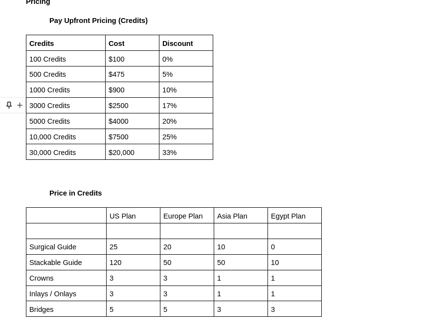

## Requirements

1. We need to make sure stripe called once credit granted
2. We need to make sure product credits can be changed in the plan
3. We need to add/remove products from plan

---

## Notes & Observations

- ingest will always fire
- Trial credits are applied on all products
- if customer ended a plan credits will be there
- Ingest credits will fire even if it not in the plan

---

## Scenarios

1. ingest events (to non-existing product in the plan / non-existing at all)
2. ingest acts differently on api calls than on dashboard (fails when customer is not in a plan)
3. switch plans (credits will remains)
4. product specific credits (no effect if not in the plan)
5. link case cloud user to metronome (using ingest alias)
6. stipe can only void an open invoice (not paid), if paid we need to refund

---

## APIs

---

## Docs Resources

- [Per-customer billing configuration](https://docs.metronome.com/invoicing/how-invoicing-works/invoicing-with-stripe/#stripe-customer-id)
- [invoice status sync](https://docs.metronome.com/invoicing/how-invoicing-works/invoicing-with-stripe/#invoice-status-sync)
- [model free trial](https://docs.metronome.com/invoicing/how-billing-works/manage-credits/#model-free-trial-credits)
- [model prepaid credit plans](https://docs.metronome.com/invoicing/how-billing-works/manage-credits/#model-prepaid-credit-plans)
- [void credit grant](https://docs.metronome.com/invoicing/how-billing-works/manage-credits/#void-a-credit-grant)

---
